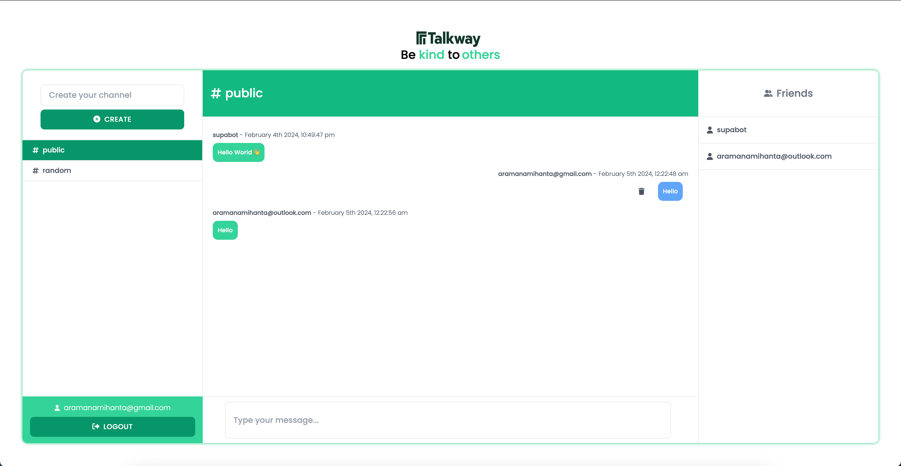

# Talkway 🗣️✉️


[](https://supabase.com)

<p align="center">
  
</p>

Talkway is not just another messaging app; it's a vibrant community where ideas flow, friendships blossom, and collaboration thrives. With intuitive features and a user-friendly interface, Talkway empowers you to engage in conversations that matter, whether you're connecting with friends, colleagues, or like-minded individuals from around the world.

> For those how to need to test it , you can directly check it on vercel deployment [here](https://talkway.vercel.app/)

## Getting Started

First, because we use [Bun](https://bun.sh/) as Package Manager you need to install it first:

```bash
curl -fsSL https://bun.sh/install | bash -s "bun-v1.0.0"
```

Second, we use [Supabase](https://supabase.com/) as realtime database we need to install it localy or you can use directly on web and get the supabase_url and supabase_anon_key.

To install it localy, we need to install Supabase CLI, we can check the docs about it [here](https://supabase.com/docs/guides/cli/getting-started)

> We need to have [Docker](https://www.docker.com/) installed and running for this.

Homebrew

```bash
brew install supabase/tap/supabase
```

Linux packages are provided in [Releases](https://github.com/supabase/cli/releases).
To install, download the .apk/.deb/.rpm file depending on your package manager and run one of the following:

```bash
sudo apk add --allow-untrusted <...>.apk
sudo dpkg -i <...>.deb
sudo rpm -i <...>.rpm
```

After all of these steps , run the Supabase on command line via:

```bash
supabase login
```

For running it run this command:

```bash
supabase start
```

After you ran this command check the Supabase Studio [here](http://127.0.0.1:54323)

To stop it:

```bash
supabase stop
```

Update your `.env` or `.env.local` with your key supabase url and anon key

```env
NEXT_PUBLIC_SUPABASE_URL=your-api-url
NEXT_PUBLIC_SUPABASE_ANON_KEY=your-anon-key
```

After all theses steps , import the `schema.sql` file to Supabase SQL Editor and import it , it will create a we need for our Database.

And finally, install deps:

```bash
bun install
```

And for the last , you can run the server with this command:

```bash
npm run dev
```

Open [http://localhost:3000](http://localhost:3000) with your browser to see the result.

Join Talkway today and experience the power of meaningful conversations. Let's talk the Talkway!

## License

[MIT](LICENSE).
